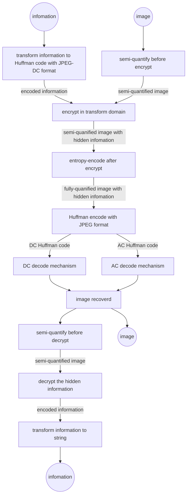

# 图像处理大作业

## 基础知识练习题

### 2

- 画出一个圆：

```matlab
% No.1
I = load('hall.mat');
I = I.hall_color;
imshow(I);
% 使用images.roi.Circle作圆
h = images.roi.Circle(gca,'Center',[84,60],'Radius',60, 'Color', 'r', 'FaceAlpha', 0, 'InteractionsAllowed', 'none');
```


- 使用mask: 在images能够使用的函数里大约找了两个小时，也没有找到一个合适的函数来直接生成与像素位置有关的mask，因此只能手写for循环实现：

```matlab
% No.2
for a = 1: 3
    for b = 1: 120
        for c = 1: 168
            if mod(b+c, 2) == 0
                I(b, c, a) = 0;
            end
        end
    end
end
imshow(I);
```


## 图像压缩编码练习题

### 1

不能，理由如下：

```matlab
choosed_block = I(1: 8, 1: 8);
% do dct2 first, then sub 128
tmp_1_1 = dct2(choosed_block) - 128;
% do sub 128 first, then do dct2
tmp_1_2 = dct2(choosed_block - 128);
figure(1);
subplot(1,2,1);
imshow(tmp_1_1);
title('do dct2 first, then sub 128');
set(gca, 'FontSize', 12);
subplot(1,2,2);
imshow(tmp_1_2);
title('do sub 128 first, then do dct2');
set(gca, 'FontSize', 12);
```


很明显，两者的结果不一样。

### 2

自定义dct2函数：

```matlab
function C = my_dct2(P)
    P = double(P - 128);    % minus the DC component, and convert uint8 to double
    tmp = size(P);
    N = tmp(1);             % get size of the input block
    D = zeros(N);  
    
    % compute matrix D
    D(1, :) = sqrt(1/2);
    for a = 2: N
        for b = 1: N
            D(a, b) = cos((a-1)* (2*b-1)* pi/ (2*N));
        end
    end
    D = D * sqrt(2/ N);
    disp(D);

    % compute C
    C = D* P* D';
end
```

在jpeg.m中调用my_dct2并作图验证：

```matlab
choosed_block = I(1: 8, 1: 8);
D_by_matlab_dct2 = dct2(choosed_block - 128);
D_my_dct2 = my_dct2(choosed_block);
figure(2);
subplot(1,2,1);
imshow(D_by_matlab_dct2);
title('matlab-dct2');
set(gca, 'FontSize', 12);
subplot(1,2,2);
imshow(D_my_dct2);
title('my-dct2');
set(gca, 'FontSize', 12);
```


由此可见，两者确实一样。

### 3

- 将后面的列置为0（为使得视觉效果明显，将列总数调大了许多）：

```matlab
t1 = 1;
t2 = 1;
N = 120;
choosed_block_3 = I((t1-1)*N+1: t1*N, (t2-1)*N+1: t2*N);
C = dct2(choosed_block_3 - 128);
% set the four right columns to zeros
C(: , round(N/2):N) = 0;
disp(C)
distorted_block_1 = idct2(C);
figure(3);
subplot(1,2,1);
imshow(choosed_block_3);
title('origin');
set(gca, 'FontSize', 12);
subplot(1,2,2);
imshow(distorted_block_1);
title('distorted');
set(gca, 'FontSize', 12);
```


- 将前面的列置为0：


由此可见，将列消除的效果都会使得图像在纵向更加光滑，而消除前面的列明显影响更大。

### 4

```matlab
t1 = 1;
t2 = 1;
N1= 120;
N2 = 160;
choosed_block_4 = I((t1-1)*N1+1: t1*N1, (t2-1)*N2+1: t2*N2);
C_origin = dct2(choosed_block_4 - 128);
figure(4);   % origin
subplot(2,2,1);
imshow(choosed_block_4);
title('origin');
set(gca, 'FontSize', 12);
C_transpose = C_origin'; % transpose
block_transpose = idct2(C_transpose);
subplot(2,2,2);
imshow(block_transpose);
title('transpose');
set(gca, 'FontSize', 12);
C_rotate_90 = rot90(C_origin, 1);   % rotate 90
block_rotate_90 = idct(C_rotate_90);
subplot(2,2,3);
imshow(block_rotate_90);
title('rotate 90');
set(gca, 'FontSize', 12);
C_rotate_180 = rot90(C_origin, 2);   % rotate 180
block_rotate_180 = idct(C_rotate_180);
subplot(2,2,4);
imshow(block_rotate_180);
title('rotate 180');
set(gca, 'FontSize', 12);
```


由此可见，旋转之后，由于直流分量的位置发生了改变，直接导致了图像中充满了噪声。但是在转置时，直流分量的位置仍然固定，因此图像依然较为清晰。

### 5

DC分量的差分可以等效为以下离散系统：
$$
s(n)=e(n-1)-e(n)
$$
则利用$freqz$ 函数，可以得到其DTFT幅频特性曲线：

```matlab
a = 1;
b = [-1, 1];
figure(5);
freqz(b, a, 200);
```


由此可见，其为高通系统。

现进行差分，其实是一种去冗余的操作。因此DC分量中的直流频率分量更多。如此一来，先进行差分，可以使得DC范围大幅下降（编码长度减小），而精度不受损失。

### 6

由DC表可得，预测误差的二进制位数对应着$Categery$的值。

### 7

有两种方法：

- 使用for循环，得到zig-zag编码
- 使用数组索引，对原矩阵元素进行展开重排

在matlab中，应尽可能少的使用for循环，而matlab的数组有自带index索引功能，故选用后者进行设计：

```matlab
function Z = zig_zag_code(A)
    storage_index = [
        1,...
        2,9,...
        17,10,3,...
        4,11,18,25,...
        33,26,19,12,5,...
        6,13,20,27,34,41,...
        49,42,35,28,21,14,7,...
        8,15,22,29,36,43,50,57,...
        58,51,44,37,30,23,16,...
        24,31,38,45,52,59,...
        60,53,46,39,32,...
        40,47,54,61,...
        62,55,48,...
        56,63,...
        64
    ];
    A = A';
    A = A(:);
    Z = A(storage_index);
end
```

十分高效。

### 8

设计代码如下：

```matlab
function Z_q = quantify(I, Q)
    % get height and width of the input image
    s = size(I);
    H = s(1);
    W = s(2);
    N = 8;

    % tackle by blocks
    Z_q = zeros(N*N , H*W / (N*N));
    for a = 1 : N : (H/N - 1) * N + 1
        for b = 1 : N : (W/N - 1) * N + 1
            block_tmp = I(a : a+N-1 , b : b+N-1);
            block_tmp = double(block_tmp);
            block_tmp_C = dct2(block_tmp - 128);
            block_tmp_Q = round(block_tmp_C ./ Q);
            block_tmp_Z = zig_zag_code(block_tmp_Q);
            tmp = floor(a/N) * (W/N) + floor(b/N) + 1;
            Z_q(: , tmp) = block_tmp_Z;
        end
    end
end
```

将量化所得的$64\times315$矩阵显示出来：


由此可见，经过量化后，每一个区域的高频分量已经变为0（在图像中，黑色为0），为下文的熵编码做了准备工作。

### 9

- 编码DC部分：

```matlab
function DC_stream = DC_encode(Z_q_DC, DC)
    % create empty DC stream
    DC_stream = [];

    % do difference first
    DC_diff = -diff(Z_q_DC);
    DC_diff = [Z_q_DC(1), DC_diff];

    % do DC encode
    for k = 1 : length(DC_diff)
        tmp = DC_diff(k);
        % 0 situation must be considerd exclusively, 
        % for de2bi(0) also has length 1
        if tmp == 0 
             % tmp_Huffman = [0, 0];
             % tmp_binary = 0;
             DC_stream = [DC_stream, [0,0,0]];
             continue;
        end
        tmp_if_negative = (tmp < 0);
        tmp_binary = flip(de2bi(abs(tmp)));  % de2bi's input can only be non-negatve
        if tmp_if_negative
            tmp_binary = 1 - tmp_binary;    % 1-component of negative input
        end
        tmp_index = DC(length(tmp_binary) + 1, :);
        tmp_Huffman_length = tmp_index(1);
        tmp_Huffman = tmp_index(2: 1+tmp_Huffman_length);
        DC_stream = [DC_stream, tmp_Huffman, tmp_binary];
    end
end
```

- 编码AC部分：

```matlab
function AC_stream = AC_encode(Z_q_AC, AC)
    % create empty AC stream
    AC_stream = [];
    [~, W] = size(Z_q_AC);

    % outer loop gets every block's AC information
    for a = 1 : W
        block_AC = Z_q_AC(:, a);   
        block_non_zeros = [0; find(block_AC ~= 0)]; % find non-zeros of one block

        % inner loop computes AC_stream
        for b = 2 : length(block_non_zeros)

            % get run and number
            tmp = block_AC(block_non_zeros(b));
            count_zeros = block_non_zeros(b) - block_non_zeros(b-1) - 1;

            % tackle the situation when run >= 16
            while count_zeros >= 16
                AC_stream = [AC_stream, [1,1,1,1,1,1,1,1,0,0,1]];
                count_zeros = count_zeros - 16;
            end

            % get size
            tmp_if_negative = (tmp < 0);
            tmp_binary = flip(de2bi(abs(tmp)));  % de2bi's input can only be non-negatve
            if tmp_if_negative
                tmp_binary = 1 - tmp_binary;    % 1-component of negative input
            end
            tmp_length = length(tmp_binary);

            % get Huffman code
            tmp_index = AC(10 * count_zeros + tmp_length, :);
            tmp_Huffman_length = tmp_index(3);
            tmp_Huffman = tmp_index(4: 3 + tmp_Huffman_length);
            AC_stream = [AC_stream, tmp_Huffman, tmp_binary];
        end

        % add EOB to AC_stream
        AC_stream = [AC_stream, [1,0,1,0]];
    end
end
```

- 整体编码：

```matlab
function [DC_stream, AC_stream] = encode(Z_q, DC, AC)
    [H, ~] = size(Z_q);
    Z_q_DC = Z_q(1, :);
    Z_q_AC = Z_q(2:H, :);
    DC_stream = DC_encode(Z_q_DC, DC);
    AC_stream = AC_encode(Z_q_AC, AC);
end
```

- 保存数据至文件部分：

```matlab
[DC_stream, AC_stream] = encode(Z_q, DC, AC);
[I_H, I_W] = size(I);
save('jpegcodes.mat', 'I_H', 'I_W', 'DC_stream', 'AC_stream');
```


由此可见，编码生成成功。

### 10

在上一张图片中,double型的数据实际上是bit，而原始图片的数据为uint8型，因此压缩比为：
$$
\eta =\frac{120\times 168\times 8}{23072+2054}=6.41885
$$

### 11

- 解码DC部分：

```matlab
function DC_decode_array = DC_decode(DC_stream, DC)
    DC_decode_array = [];
    index = 1;
    [H, ~] = size(DC);
    while(index < length(DC_stream))

        % scan DC to fit Hufffman code
        for k = 1: H
            tmp_Huffman_length = DC(k, 1);
            tmp_Huffman = DC(k, 2: tmp_Huffman_length+1);
            if isequal(tmp_Huffman, DC_stream(index: index+tmp_Huffman_length-1))
                index = index + tmp_Huffman_length;
                break
            end
        end
        
        % get data
        if k == 1   % data = 0 should be considered exclusively
            tmp_data_de = 0;
            index = index + 1;
        else
            tmp_data_bi = DC_stream(index: index+k-2);
            if tmp_data_bi(1) == 0  % if data < 0, more operation is needed
                is_negative = 1;
            else
                is_negative = 0;
            end
            if is_negative
                tmp_data_bi = 1 - tmp_data_bi;
                tmp_data_de = -bi2de(flip(tmp_data_bi));
            else
                tmp_data_de = bi2de(flip(tmp_data_bi));
            end
            index = index + k - 1;
        end
        
        % put data into DC_decode_array
        if isempty(DC_decode_array) 
            DC_decode_array = [DC_decode_array, tmp_data_de];
        else
            tmp_data_de = DC_decode_array(end) - tmp_data_de;
            DC_decode_array = [DC_decode_array, tmp_data_de];
        end
    end
end
```

- 解码AC部分：

```matlab
function AC_decode_array = AC_decode(AC_stream, AC)
    AC_decode_array = [];
    index = 1;
    tmp_array = []; % store one block's AC code
    [H, ~] = size(AC);
    while index < length(AC_stream) 
        
        
        % Huffman decode
        flag = 1;   % deal with EOB condition
        for k = 1: H
            tmp_Huffman_length = AC(k, 3);
            tmp_Huffman = AC(k, 4: tmp_Huffman_length+3);
            tmp_index_end = index+tmp_Huffman_length-1;
            if tmp_index_end >= length(AC_stream)   % end of AC_stream: out of range!
                break;
            end
            if isequal(tmp_Huffman, AC_stream(index: tmp_index_end))
                index = index + tmp_Huffman_length;
                flag = 0;
                break
            end
        end

        % get run, size and data itself
        if flag % EOB condition or 16-zeros condition
            if isequal(AC_stream(index: index + 10), [1,1,1,1,1,1,1,1,0,0,1])
                % 16-zeros
                zeros_filled = zeros(1, 16);
                tmp_array = [tmp_array, zeros_filled];
                index = index + 11;
                continue;
            else
                % EOB
                zeros_filled = zeros(1, 63 - length(tmp_array));
                tmp_array = [tmp_array, zeros_filled];
                AC_decode_array = [AC_decode_array, tmp_array];
                tmp_array = [];
                index = index + 4;
                continue;
            end
        end
        tmp_run = AC(k, 1); % run
        tmp_size = AC(k, 2);    % size
        tmp_data_bi = AC_stream(index: index + tmp_size - 1);
        if tmp_data_bi(1) == 0
            tmp_data_bi = 1 - tmp_data_bi;
            tmp_data_de = -bi2de(flip(tmp_data_bi));
        else
            tmp_data_de = bi2de(flip(tmp_data_bi));
        end
        index = index + tmp_size;

        % update tmp_array
        tmp_array = [tmp_array, zeros(1, tmp_run), tmp_data_de];
    end
end

```

两部分解码之后，已经可以生成Z_q验证纯解码部分的正确性：


由此可见，解码部分完全正确。

- 图像复原部分

```matlab
function I = recover(H, W, DC_decode_array, AC_decode_array, Q)
    I = zeros(H, W);
    step_range = W / 8;
    storage_index = [
        1,2,6,7,15,16,28,29,...
        3,5,8,14,17,27,30,43,...
        4,9,13,18,26,31,42,44,...
        10,12,19,25,32,41,45,54,...
        11,20,24,33,40,46,53,55,...
        21,23,34,39,47,52,56,61,...
        22,35,38,48,51,57,60,62,...
        36,37,49,50,58,59,63,64
    ];
    for k = 1: length(DC_decode_array)
        tmp_DC = DC_decode_array(k);
        tmp_AC = AC_decode_array(63 * (k-1) + 1: 63 * k);
        tmp_block = [tmp_DC, tmp_AC];
        tmp_block = tmp_block(storage_index);
        tmp_block = reshape(tmp_block, 8, 8);
        tmp_block = tmp_block';
        tmp_block = tmp_block .* Q;
        tmp_block = idct2(tmp_block);
        tmp_block = round(tmp_block + 128);
        w_index = mod(k - 1, step_range);
        h_index = floor((k - 1) / step_range);
        I(h_index * 8 + 1: (h_index + 1) * 8, w_index * 8 + 1: (w_index + 1) * 8) = tmp_block;
        
    end
    I = uint8(I);	# 一定要注意double到uint8的转换！！
end
```

- 顶层复原函数：

```matlab
function I = decode(filename, Q, DC, AC)
    % load necessary data
    data = load(filename);
    H = data.I_H;
    W = data.I_W;
    DC_stream = data.DC_stream;
    AC_stream = data.AC_stream;
    DC_decode_array = DC_decode(DC_stream, DC);
    AC_decode_array = AC_decode(AC_stream, AC);
    I = recover(H, W, DC_decode_array, AC_decode_array, Q);
end
```


由此可见，图像复原相当成功！

- 进一步，将9到11中的所有函数进行整合，可得集量化、编码、解码、还原于一体的函数$jpeg-transmission$ ，形式如下：

```matlab
function I_recoverd = jpeg_transmission(I, Q, DC, AC)
    Z_q = quantify(I, Q);
    [DC_stream, AC_stream] = encode(Z_q, DC, AC);
    [I_H, I_W] = size(I);
    save('jpegcodes.mat', 'I_H', 'I_W', 'DC_stream', 'AC_stream');
    I_recoverd = decode('jpegcodes.mat', Q, DC, AC);
end
```

- 采用PSNR客观评价压缩质量：

```matlab
I_recoverd = jpeg_transmission(I, Q, DC, AC);
delta = I_recoverd - I;
MSE = sum(sum(delta .* delta)) / (120 * 168);
PSNR = 10 * log10(255 ^ 2 / MSE);
disp(PSNR);
```

计算结果为$34.9dB$，可见，压缩质量相当好。

### 12


Q总体缩减一半后，对视觉效果似乎并没有造成什么重大影响，虽然在理论上它应该会更加精确。

### 13

- “雪花”压缩前后对比：


并没有看出什么明显的差别。

- 采用PSNR客观评价压缩质量，得到的结果为$32.18dB$，比测试图像的效果要差一些。个人认为，可能的原因是相比于测试图像，雪花图像中包含更多的高频分量，而这在量化时会被舍去，因而造成较大的损失。

## 信息隐藏练习题

信息隐藏中，我采用了与JPEG的DC编码中相似的编码格式来表示将要录入图片的信息。首先，为了方便获取和破解隐藏在图片中的信息，定义字符串与二进制Huffman码的转换函数：

- 字符串转Huffman码：

```matlab
function huff = info2huff(info, DC)
    huff = [];
    info_de = abs(info);
    for k = 1: length(info_de)
        tmp = info(k);
        tmp_binary = flip(de2bi(abs(tmp)));
        tmp_index = DC(length(tmp_binary) + 1, :);
        tmp_Huffman_length = tmp_index(1);
        tmp_Huffman = tmp_index(2: 1+tmp_Huffman_length);
        huff = [huff, tmp_Huffman, tmp_binary];
    end
    END_OF_HUFF = [1,1,1,1,1,1,1,1,1,1,0];	% 自定义的终止符，与DC编码中的Huffman码兼容
    huff = [huff, END_OF_HUFF];
end
```

- Huffman码转字符串：

```matlab
function info = huff2info(huff, DC)
    info = [];
    index = 1;
    [H, ~] = size(DC);
    while index < length(huff)

        flag = 1;
        % scan DC to fit Hufffman code
        for k = 1: H
            tmp_Huffman_length = DC(k, 1);
            tmp_Huffman = DC(k, 2: tmp_Huffman_length+1);
            if isequal(tmp_Huffman, huff(index: index+tmp_Huffman_length-1))
                index = index + tmp_Huffman_length;
                flag = 0;
                break
            end
        end

        % if no matched Huffman code, just terminate the decode
        if flag
            break;
        end

        % get data
        if k == 1   % data = 0 should be considered exclusively
            tmp_data_de = 0;
            index = index + 1;
        else
            tmp_data_bi = huff(index: index+k-2);
            tmp_data_de = bi2de(flip(tmp_data_bi));
            index = index + k - 1;
        end
        
        % put data into info
        info = [info, mod(tmp_data_de, 128)];	% 取余是为了防止解码过程中的乱码影响到了0-127的ASCII码值而产生报错。
        info = char(info);
    end
end
```

- 需要隐藏的信息：

```matlab
string = ['Tom is a spy! Amy is also a spy! They are going to kill you on Monday! ',...
        'I think the best way to prevent this disaster is to eat some ice cream.'...
        'However, my mom do not think so. She said you should do your homework first.'...
        'Tom is a spy! Amy is also a spy! They are going to kill you on Monday! ',...
        'I think the best way to prevent this disaster is to eat some ice cream.',...
        'However, my mom do not think so. She said you should do your homework first.,'...
        'Tom is a spy! Amy is also a spy! They are going to kill you on Monday! ',...
        'I think the best way to prevent this disaster is to eat some ice cream.',...
        'However, my mom do not think so. She said you should do your homework first.'];
```

之所以选择如此复杂的一段话，是为了让隐藏的信息对图像失真的影响更明显，对信息还原程度也更敏感，从而可以更好地对比不同隐藏方式的优劣。

### 1

- 空域隐藏信息：

```matlab
function image_encrypt = encrypt_in_space(I, huff)
    image_encrypt = I;
    [~, W] = size(I);
    index = 1;
    while index < length(huff)
        flag = 1;
        if index + 64 > length(huff)
            block_huff = [huff(index: length(huff)), zeros(1, 63 - length(huff) + index)];
            flag = 0;
        else
            block_huff = huff(index: index + 63);
        end
        k = floor(index / 64);
        W_range = W / 8;
        a = floor(k / W_range);
        b = mod(k, W_range);
        block = I(a * 8 + 1: (a+1) * 8, b * 8 + 1: (b+1) * 8);
        image_encrypt(a * 8 + 1: (a+1) * 8, b * 8 + 1: (b+1) * 8) = block_encrypt_in_space(block, block_huff);
        if flag
            index = index + 64;
        else
            break;
        end
        % imshow(image_encrypt);
    end
end

function block_encrypt = block_encrypt_in_space(block, block_huff)	% 按块存储信息。
    block_encrypt = zeros(8, 8);
    for a = 1: 8
        for b = 1: 8
            point = block(a, b);
            point_code = block_huff((a-1) * 8 + b);
            block_encrypt(a, b) = 2 * floor(point / 2) + point_code;
        end
    end
    block_encrypt = uint8(block_encrypt);
end
```

其中隐藏时并不是普通的按列隐藏，而是按$8\times8$的块来存储信息，只不过在扫描块时仍是顺序扫描，亦即，一个块被填满了之后，才将Huffman码填到下一块。

- 空域解码信息：

```matlab
function huff = decrypt_in_space(I)
    [H, W] = size(I);
    huff = zeros(1, H*W);
    index = 1;
    while index < length(huff)
        k = floor(index / 64);
        W_range = W / 8;
        a = floor(k / W_range);
        b = mod(k, W_range);
        block = I(a * 8 + 1: (a+1) * 8, b * 8 + 1: (b+1) * 8);
        huff(index: index + 63) = block_decrypt_in_space(block);
        index = index + 64;
    end
end

function huff_decrypt = block_decrypt_in_space(block)
    huff_decrypt = zeros(1, 64);
    for a = 1: 8
        for b = 1: 8
            point = block(a, b);
            huff_decrypt(8 * (a-1) + b) = mod(point, 2);
        end
    end
end
```

- 倘若不经过JPEG压缩，设计代码，观察信息是否能还原：

```matlab
I_encrypt = encrypt_in_space(I, huff);
% I_recoverd = jpeg_transmission(I, Q, DC, AC);
huff_decrypt = decrypt_in_space(I_encrypt);
info_decrypt = huff2info(huff_decrypt, DC);
disp('after_decrypt:');
disp(info_decrypt);
```


发现确实能还原，说明信息隐藏与还原代码均正确。

- 经过JPEG压缩后，再次观察代码还原程度：


发现根本无法还原，说明空域隐藏信息在JPEG编码格式下不可用。

- 图像受损程度：


发现图像质量影响不大。

### 2

- 定义变换域信息隐藏范式：



- 依照范式写出顶层代码：

```matlab
figure(2);
subplot(2,1,1);
imshow(I);
title('before encrypt');
set(gca, 'FontSize', 12);
I_before_encrypt = quantify_before_encrypt(I, Q);
I_encrypt_in_transform_1 = encrypt_in_transform_1(I_before_encrypt, huff);
Z_q = entropy_encode_after_quantify(I_encrypt_in_transform_1);
[DC_stream, AC_stream] = encode(Z_q, DC, AC);
DC_decode_array = DC_decode(DC_stream, DC);
AC_decode_array = AC_decode(AC_stream, AC);
I_recover_before_decrypt = recover_before_decrypt_in_transform_1(H, W, DC_decode_array, AC_decode_array);
huff_decrypt = decrypt_in_transform_1(I_recover_before_decrypt);
info_decrypt = huff2info(huff_decrypt, DC);
disp('after_decrypt:');
disp(info_decrypt);
I_recover = recover_after_decrypt_in_transform_1(H, W, I_recover_before_decrypt, Q);
subplot(2,1,2);
imshow(I_recover);
title('after decrypt');
set(gca, 'FontSize', 12);
```

下面着重介绍几个重点函数：

- 隐藏信息与获取信息（最重要的函数，在不同的隐藏方式下需要重写）：直接调用空域函数即可（这是由于变换域的第一种方法与空域方法在隐藏于获取信息上，具有完全相似的形式）

```matlab
function I_encrypt_in_transform_1 = encrypt_in_transform_1(I, huff)	% 隐藏信息
    I_encrypt_in_transform_1 = encrypt_in_space(I, huff);
end

function huff = decrypt_in_transform_1(I)	% 获取信息
    huff = decrypt_in_space(I);
end
```

- 其余部分均是调用已有的函数，此处不再赘述。
- 隐藏信息后图片的失真：


由此可见，图片失真极为严重，这是由于隐藏信息时将DC分量与AC分量全改掉了。个人认为，修改DC分量不会造成过大的图像失真，一是因为其量化步长小，在最末位改动时，与原来的误差仅为一个较小的量化步长；但是修改了高频的AC分量将会对图像产生巨大影响，因为其量化步长极大，获取信息时很有可能将高频分量增加一个大的量化步长，使得图片失真严重。

- 信息的还原程度：


由此可见，什么都没有还原出来。这是因为二次量化后，隐藏在高频分量中的数据被大量化步长消除了。

### 3

- 收到上一种隐藏格式的启发，我在这次优先填充整张图中的DC分量和低频AC分量，在可以更大程度还原数据的情况下，尽可能减少图像的失真，具体思路可以用下图表示：


其中，块大小为4，每一块中的索引顺序仍然按照$zig-zag$顺序，以确保横纵的对称性。如此一来，由信息隐藏的数据失真优先分布在量化步长小、本身值较大的DC分量与低频AC分量上，在图像解码时可以带来较小的失真。

并且，DC分量与低频AC分量的量化步长小，优先在它们上面填数据，可以使得隐藏的数据在二次量化后被还原的可能性更大。

而在代码层面，由2中的范式，我们只需重写隐藏信息与获取信息的函数即可，其余均可复用：

- 隐藏信息重写：

```matlab
function I_encrypt_in_transform_2 = encrypt_in_transform_2(I, huff)
    I_encrypt_in_transform_2 = I;
    [H, W] = size(I);
    step = H * W / 64;
    % set mod(huff, step) = 0, in order to do matrix transform
    huff = [huff, zeros(1, step - mod(length(huff), step))]; 
    iter_time = length(huff) / step;   
    huff = reshape(huff, step, iter_time);
    huff = huff';
    for k = 1 : iter_time
        [x, y] = find_zig_zag_position(k);
        for a = 0 : H/8 - 1
            for b = 0 : W/8 - 1
                tmp = I_encrypt_in_transform_2(a * 8 + 1 + x, b * 8 + 1 + y);
                code = huff(k, a * W/8 + b + 1);
                I_encrypt_in_transform_2(a * 8 + 1 + x, b * 8 + 1 + y) = code + 2 * floor(tmp / 2);
            end
        end
    end
end
```

- 获取信息重写：

```matlab
function huff = decrypt_in_transform_2(I)
    [H, W] = size(I);
    huff = zeros(1, H*W);
    step = H * W / 64;
    for k = 1 : 64
        [x, y] = find_zig_zag_position(k);
        for a = 0 : H/8 - 1
            for b = 0 : W/8 - 1
                tmp = I(a * 8 + 1 + x, b * 8 + 1 + y);
                position = (k-1) * step + a * (W/8) + b + 1;
                huff(position) = mod(tmp, 2);
            end
        end
    end
end
```

- 两者都调用了$zig-zag$编码位置获取函数：

```matlab
function [x, y] = find_zig_zag_position(index)	% 只需一个简单的索引
    storage_index = [
        1,...
        2,9,...
        17,10,3,...
        4,11,18,25,...
        33,26,19,12,5,...
        6,13,20,27,34,41,...
        49,42,35,28,21,14,7,...
        8,15,22,29,36,43,50,57,...
        58,51,44,37,30,23,16,...
        24,31,38,45,52,59,...
        60,53,46,39,32,...
        40,47,54,61,...
        62,55,48,...
        56,63,...
        64
    ];
    tmp = storage_index(index) - 1;
    x = floor(tmp / 8);
    y = mod(tmp, 8); 
end
```

- 信息还原结果：


虽然不尽如人意，但已经比空域与变换域第一种方法强了不少。

- 图片失真结果：


不论在图像失真的减小上，还是信息还原程度上，确实比第一种变换域隐藏方法进步了许多。

- 一些反思：

  - 尽管做了如此好的改进，数据还是无法很好地还原，这不禁让人怀疑可能是Q值过大，使得隐藏在末位地数据被量化步长消除掉了。为了验证这一结果，我将Q值除以了2，只用了第二种变换域方法，再次观察效果：

  

  

  由此可见，还原程度已经相当高！

  - 后面我在思考，是不是我的字符串设计地过于复杂，导致$120\times168$的图像上没法承载这么多的信息（因为不论如何设置隐藏位置，总会涉及到高频分量）？于是乎，我把字符串改简单了许多，把Q值调整到了最初状态，在以上几种方法上都重新做了尝试：

    - 空域：

    

    ​	一塌糊涂。

    - 变换域1：

    

    ​	 一塌糊涂。

    - 变换域2：

    

    ​	完美！

  - 以上两点可以看出，变换域2的方法较前两者相比，有着巨大的优越性。

  